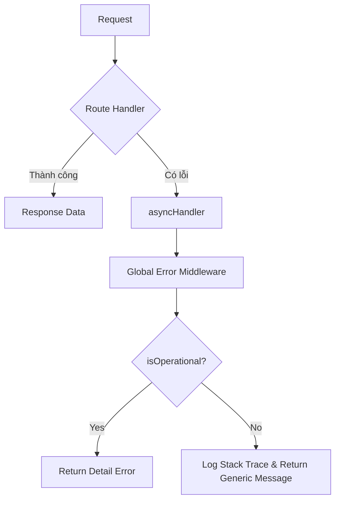

# 🛠️ BÀI TẬP: XÂY DỰNG HỆ THỐNG QUẢN LÝ LỖI (ERROR HANDLING)

> **Dự án:** Công cụ chuyển đổi PDF sang Excel (PDF2Excel Service)

---

## 📖 1. Giới thiệu
Bạn đang phát triển API cho một dịch vụ chuyển đổi file chuyên nghiệp. Trong quá trình vận hành, hệ thống rất dễ gặp các sự cố như:
- 📄 File đầu vào bị lỗi hoặc không đúng định dạng.
- 📉 Máy chủ cạn kiệt tài nguyên (RAM, CPU).
- 📦 Lỗi từ các thư viện bên thứ ba.

**Nhiệm vụ của bạn:** Xây dựng một cơ chế xử lý lỗi tập trung (Centralized Error Handling) để đảm bảo ứng dụng luôn ổn định, không bị crash bất ngờ và phản hồi thông tin chuyên nghiệp cho người dùng.

---

## 🎯 2. Các yêu cầu thực hiện

### 🔴 Phần 1: Phân loại lỗi (Custom Error Class)
Tạo file `AppError.js` để định nghĩa cấu trúc lỗi riêng cho dự án.
- [ ] Kế thừa từ lớp `Error` gốc của JavaScript.
- [ ] Tham số đầu vào: `message` (thông báo) và `statusCode` (mã lỗi HTTP: 400, 404, ...).
- [ ] Tự động thiết lập thuộc tính `status` dựa trên `statusCode` (4xx: 'fail', 5xx: 'error').
- [ ] Thêm thuộc tính `isOperational = true` để đánh dấu đây là lỗi "vận hành" (do người dùng hoặc môi trường, không phải bug code).

### ⚡ Phần 2: Bộ bọc hàm bất đồng bộ (asyncHandler)
Viết một hàm wrapper tên là `asyncHandler` để tối ưu code.
- [ ] Nhận vào một Route Handler (hàm `async`).
- [ ] Sử dụng `.catch(next)` để tự động chuyển mọi lỗi bất đồng bộ về Middleware xử lý lỗi trung tâm.
- [ ] Mục tiêu: Loại bỏ hoàn toàn các khối `try-catch` lặp lại trong Controller.

### 🛡️ Phần 3: Middleware xử lý lỗi tập trung (Global Error Middleware)
Viết một Middleware đặt ở cuối file `app.js` để hứng toàn bộ lỗi:
- [ ] **Lỗi vận hành (`isOperational: true`):** Trả về JSON chứa mã lỗi và thông báo rõ ràng cho khách hàng.
- [ ] **Lỗi lập trình (Bug code):** 
    - Ghi log chi tiết (`stack trace`) ra Console để lập trình viên xử lý.
    - Trả về thông báo chung: *"Đã có sự cố xảy ra, vui lòng thử lại sau"*.

### 🌐 Phần 4: Xử lý lỗi "ngoài vùng phủ sóng" (Global Events)
Thiết lập các sự kiện trong `server.js` để đảm bảo an toàn tuyệt đối:
- [ ] `unhandledRejection`: Bắt các Promise bị reject mà quên `.catch()`.
- [ ] `uncaughtException`: Bắt các lỗi đồng bộ nghiêm trọng. 
> [!IMPORTANT]
> Khi gặp `uncaughtException`, hãy in log và đóng tiến trình (`process.exit(1)`) để khởi động lại server sạch sẽ.

---

## 🧪 3. Các tình huống giả định (Test Cases)

Sinh viên cần giả lập (`throw`) các lỗi sau để kiểm định hệ thống:

| STT | Loại lỗi | Trạng thái mong đợi | Mô tả |
| :--- | :--- | :--- | :--- |
| 1 | **Lỗi 404** | Not Found | Truy cập vào một Route không tồn tại. |
| 2 | **Lỗi 400** | Bad Request | Gửi yêu cầu nhưng không đính kèm file PDF. |
| 3 | **Lỗi 500** | Internal Server Error | Gọi một biến chưa khai báo (Bug) để kiểm tra tính bảo mật thông tin. |

---

## 📊 Luồng xử lý lỗi (Workflow)

